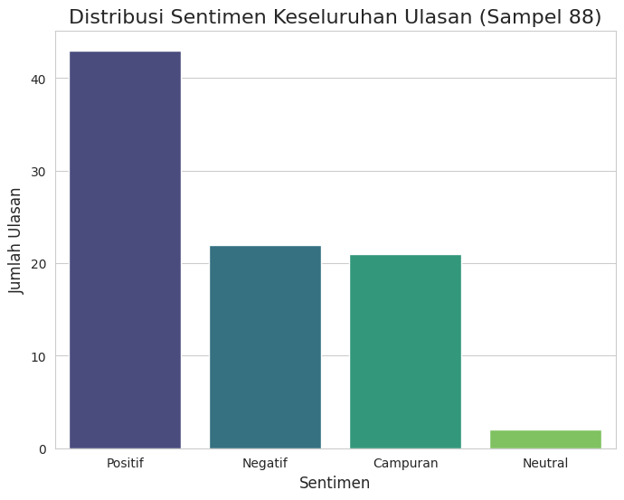
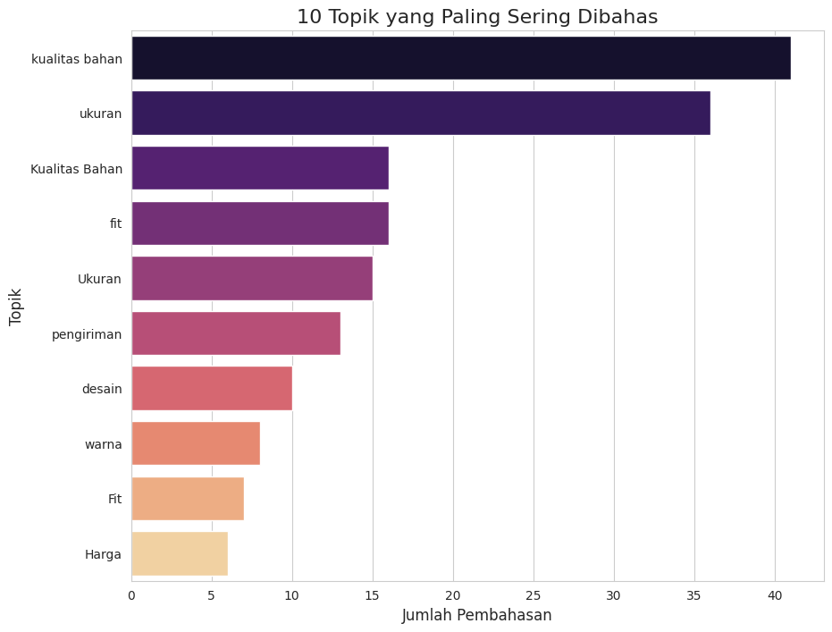
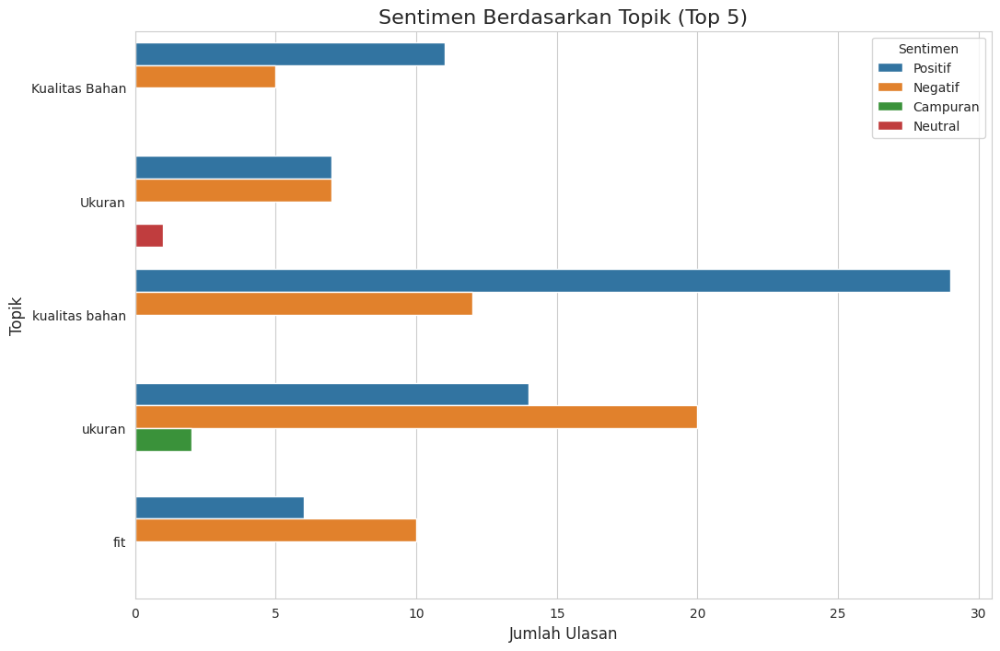

# E-commerce-Sentiment-Analysis-Granite-AI
Analisis sentimen dan ekstraksi topik ulasan e-commerce menggunakan model fondasi IBM Granite. Proyek ini mengolah data teks tidak terstruktur menjadi wawasan bisnis yang dapat ditindaklanjuti.

# Analisis Sentimen dan Ekstraksi Topik Ulasan Produk E-commerce Menggunakan IBM Granite

## Gambaran Umum Proyek (Project Overview)
Proyek ini melakukan analisis sentimen dan ekstraksi topik dari ulasan pelanggan produk e-commerce. Dengan memanfaatkan kecerdasan buatan, khususnya model fondasi **IBM Granite** melalui Replicate API, kami mengolah data ulasan teks yang tidak terstruktur menjadi wawasan yang terstruktur dan dapat ditindaklanjuti. Tujuan utamanya adalah untuk mengidentifikasi sentimen pelanggan (positif, negatif, campuran) dan topik-topik utama yang dibahas, yang dapat digunakan untuk meningkatkan kualitas produk, layanan, dan strategi bisnis.

## Link Dataset Mentah (Raw Dataset Link)
Dataset yang digunakan dalam proyek ini adalah **"E-commerce Customer Reviews"** yang tersedia secara publik di Kaggle.
* **Link Dataset:** [https://www.kaggle.com/datasets/nicapotato/womens-ecommerce-clothing-reviews](https://www.kaggle.com/datasets/nicapotato/womens-ecommerce-clothing-reviews)

## Wawasan dan Temuan (Insight & Findings)
Berdasarkan analisis terhadap 100 sampel ulasan pelanggan, kami menemukan beberapa wawasan kunci:

* **Distribusi Sentimen**: Mayoritas ulasan menunjukkan sentimen Positif (45%), diikuti oleh Negatif (22%), dan Campuran (21%).
  
    

* **Topik Paling Sering Dibahas**: Pelanggan paling sering membahas 'Kualitas Bahan', 'Ukuran', dan 'Kesesuaian (Fit)', menandakan prioritas mereka.
     
    

* **Sentimen per Topik**: 'Ukuran' dan 'Kesesuaian (Fit)' secara signifikan memicu sentimen Negatif. Ini menunjukkan area krusial untuk perbaikan.
Sebaliknya, 'Kualitas Bahan' dan 'Gaya' sebagian besar diasosiasikan dengan sentimen Positif, mengindikasikan keunggulan produk.
    
    

## Penjelasan Dukungan AI (AI Support Explanation)
Proyek ini secara ekstensif menggunakan **IBM Granite 3.2-8b-instruct** sebagai model Large Language Model (LLM) utama. Model ini diakses melalui **Replicate API**.

* **Peran AI**: IBM Granite berfungsi sebagai inti analitis, mampu memahami konteks ulasan, mengklasifikasikan sentimen, dan mengekstrak entitas kunci (topik) tanpa memerlukan pelabelan data manual yang ekstensif atau pelatihan model kustom. Hal ini mempercepat proses analisis secara signifikan dan memungkinkan skala yang lebih besar.
* **Teknik Prompt Engineering**: Kami menggunakan *prompt* yang dirancang dengan cermat untuk memandu model agar menghasilkan output dalam format JSON yang terstruktur. Ini memastikan hasil yang konsisten dan mudah diproses secara otomatis.
* **Penanganan Tantangan AI**: Kami mengimplementasikan logika coba ulang (*retry logic*) dan jeda waktu (`time.sleep()`) untuk mengatasi batasan *rate limiting* dari API, serta penanganan kesalahan untuk output JSON yang tidak valid dari model. Ini memastikan proses analisis yang tangguh dan andal.

## Dokumentasi Proyek Lengkap
Untuk rincian lengkap mengenai metodologi, masalah yang dihadapi, dan solusi yang diterapkan, silakan baca [Dokumentasi Proyek Lengkap](documentation.md).
