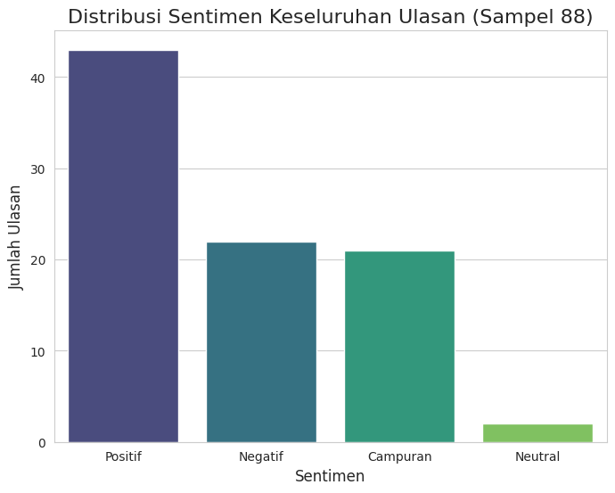

Dokumentasi Proyek Analisis Sentimen Ulasan E-commerce
Proyek ini adalah bagian dari Capstone Project Hacktiv8 & IBM Skillsbuild.

Dibuat oleh:
Miqdad Jubair

Tanggal Penyelesaian:
09 Agustus 2025

Tautan Cepat
Repositori GitHub:
https://github.com/MiqdadJubair/E-commerce-Sentiment-Analysis-Granite-AI

Dataset Asli (Kaggle):
https://www.kaggle.com/datasets/nicapotato/womens-ecommerce-clothing-reviews

Bab 1: Pendahuluan dan Perencanaan Proyek

1.1 Latar Belakang

Di era digital, ulasan pelanggan adalah sumber informasi yang tak ternilai bagi bisnis e-commerce. Ulasan ini mencerminkan pengalaman, preferensi, dan keluhan pelanggan secara langsung. Namun, mengolah ribuan ulasan secara manual adalah tugas yang tidak efisien. Proyek ini bertujuan untuk mengatasi tantangan tersebut dengan memanfaatkan kecerdasan buatan, khususnya model fondasi IBM Granite, untuk menganalisis ulasan pelanggan secara otomatis. Analisis ini akan memberikan wawasan mendalam mengenai sentimen dan topik utama yang dibicarakan pelanggan, yang dapat digunakan untuk meningkatkan kualitas produk, layanan, dan strategi bisnis.

1.2 Tujuan Proyek

Tujuan dari proyek ini adalah sebagai berikut:

Analisis Sentimen: Mengklasifikasikan setiap ulasan pelanggan sebagai Positif, Negatif, atau Campuran untuk memahami distribusi sentimen secara keseluruhan.

Ekstraksi Topik: Mengidentifikasi dan mengekstrak topik atau area fokus utama yang paling sering dibahas oleh pelanggan (contoh: kualitas kain, ukuran, harga, pengiriman).

Wawasan & Rekomendasi: Menyajikan temuan-temuan kunci dan memberikan rekomendasi bisnis yang konkret berdasarkan hasil analisis sentimen dan topik.

1.3 Sumber Data

Dataset yang digunakan dalam proyek ini adalah "E-commerce Customer Reviews" yang tersedia secara publik di platform Kaggle. Dataset ini dipilih karena relevansinya dengan domain e-commerce dan kekayaan informasinya.

Detail Dataset:

Nama File: Womens Clothing E-Commerce Reviews.csv

Jumlah Baris: Sekitar 23.486 ulasan

Kolom Penting: Review Text (teks ulasan), Rating (rating numerik), dan Recommended IND (indikator rekomendasi produk).

Alasan Penggunaan:

Relevansi Topik: Dataset ini sangat cocok dengan tujuan proyek.

Kualitas & Ketersediaan: Dataset sudah cukup bersih, terstruktur, dan tersedia dalam format CSV yang umum.

Kekayaan Informasi: Selain teks ulasan, dataset ini memiliki kolom tambahan yang berguna untuk analisis.

Bab 2: Metodologi dan Persiapan Data

2.1 Lingkungan Pengembangan

Proyek ini dikerjakan menggunakan Google Colab, sebuah platform notebook berbasis cloud. Google Colab dipilih karena kemudahannya dalam konfigurasi, akses gratis ke sumber daya komputasi, dan kompatibilitasnya dengan library Python yang diperlukan. Integrasi dengan model AI IBM Granite dilakukan melalui Replicate API, yang memungkinkan pemanggilan model secara on-demand dengan token API yang tersimpan dengan aman.

2.2 Metodologi Pra-pemrosesan Data

Data mentah dari dataset "E-commerce Customer Reviews" memerlukan serangkaian langkah pra-pemrosesan untuk memastikan kualitas dan formatnya optimal untuk analisis. Langkah-langkah yang dilakukan adalah:

Pemuatan Data: Dataset diunggah ke lingkungan Colab dan dimuat ke dalam DataFrame menggunakan library pandas.

Penghapusan Data Hilang: Baris yang memiliki nilai kosong (NaN) pada kolom Review Text dihapus.

Penghapusan Kolom Tidak Relevan: Kolom yang tidak berkontribusi langsung pada analisis sentimen, seperti Unnamed: 0 dan Title, dihapus.

Konversi Tipe Data: Kolom Review Text dikonversi menjadi tipe data string.

Proses ini menghasilkan DataFrame yang lebih bersih dan siap untuk dianalisis oleh model IBM Granite. Setelah pembersihan, total sekitar 23.486 ulasan siap untuk diproses.

Bab 3: Implementasi Analisis AI

3.1 Fungsi Analisis dengan Model IBM Granite

Sebuah fungsi Python khusus (analyze_review_with_granite) dibuat untuk berinteraksi dengan model fondasi IBM Granite melalui Replicate API. Fungsi ini mengambil teks ulasan sebagai input dan mengirimkannya ke model dengan sebuah prompt yang dirancang secara spesifik.

Prompt Engineering: Prompt yang digunakan sangat penting untuk memastikan output yang terstruktur. Kami menginstruksikan model untuk bertindak sebagai "ahli analisis ulasan e-commerce" dan meminta tiga informasi spesifik dalam format JSON:

sentimen_keseluruhan: Mengklasifikasikan sentimen menjadi 'Positif', 'Negatif', atau 'Campuran'.

area_fokus: Mengidentifikasi topik-topik kunci (misalnya, 'Ukuran', 'Kualitas Bahan', 'Harga').

ringkasan: Menyajikan ringkasan singkat dari ulasan dalam satu kalimat.

3.2 Eksekusi Analisis dan Penanganan Kesalahan

Proses analisis dilakukan secara batch pada sampel acak 100 ulasan. Metodologi ini dirancang untuk mengatasi tantangan umum seperti rate limiting dan output model yang tidak valid.

Berikut adalah langkah-langkah utama dalam proses ini:

Pengambilan Sampel: Sebanyak 100 ulasan dipilih secara acak dari DataFrame yang sudah dibersihkan.

Looping dan Permintaan API: Setiap ulasan dikirim ke fungsi analyze_review_with_granite.

Mekanisme Percobaan Ulang (Retry Logic): Jika permintaan gagal karena rate limiting (429 Too Many Requests), kode akan menunggu selama beberapa detik sebelum mencoba lagi.

Jeda Antar Permintaan: Jeda waktu (10 detik) yang konsisten ditambahkan di antara setiap permintaan yang berhasil untuk mencegah rate limiting sejak awal.

Penanganan Output Tidak Valid: Output mentah dari ulasan yang gagal dicatat, sementara baris tersebut ditandai sebagai gagal.

3.3 Pembersihan dan Persiapan Data Hasil

Setelah analisis selesai, data hasil dikumpulkan ke dalam sebuah DataFrame baru. Langkah pembersihan tambahan diperlukan:

Penghapusan Kolom Error: Kolom untuk melacak kesalahan (error dan raw_output) dihapus.

Penghapusan Baris Gagal: Baris-baris yang gagal dianalisis oleh model (yaitu, tidak memiliki data sentimen) dihapus. Hal ini menghasilkan DataFrame yang bersih dan konsisten, berisi 88 ulasan yang berhasil dianalisis sepenuhnya.

Bab 4: Visualisasi dan Wawasan

Pada bab ini, kami mengubah data yang telah dianalisis oleh model AI IBM Granite menjadi visualisasi yang mudah dipahami. Berikut adalah temuan dan wawasan utama yang didapat dari 88 ulasan yang berhasil dianalisis.

4.1 Distribusi Sentimen

Grafik ini menunjukkan seberapa sering setiap sentimen muncul dalam ulasan pelanggan.

Wawasan: Dari 88 ulasan yang dianalisis, ulasan positif mendominasi dengan 45 ulasan. Adapun ulasan negatif jauh lebih sedikit, berkisar di 22 ulasan, namun tetap signifikan. Sedangkan ulasan campuran memiliki 21 ulasan, yang menunjukkan bahwa mereka menyukai beberapa aspek produk, tetapi tidak menyukai aspek lain. Secara umum, pelanggan merasa puas, akan tetapi ada kelompok yang tidak puas yang perlu diperhatikan.

4.2 Topik yang Paling Sering Dibahas

Grafik ini menampilkan 10 topik teratas yang paling sering disebutkan oleh pelanggan.

Wawasan: Topik seperti 'Kualitas Bahan', 'Ukuran', 'Kesesuaian (Fit)', dan 'Gaya' terlihat berada di urutan teratas. Ini menunjukkan bahwa pelanggan sangat memperhatikan aspek-aspek dasar produk ini. Temuan ini menegaskan bahwa kualitas fisik dan kecocokan produk adalah faktor penentu utama dalam kepuasan pelanggan. Bisnis dapat menggunakan informasi ini untuk memprioritaskan perbaikan produk dan strategi pemasaran.

4.3 Sentimen Berdasarkan Topik

Grafik ini memberikan wawasan yang lebih dalam dengan memisahkan sentimen untuk setiap topik utama.

 

Wawasan:

Sentimen Negatif yang Dominan: Pada topik 'Ukuran' dan 'Kesesuaian (Fit)', kita melihat sentimen negatif yang signifikan. Ini menunjukkan bahwa produk sering kali tidak sesuai dengan ekspektasi pelanggan, yang bisa disebabkan oleh ketidakakuratan tabel ukuran.

Sentimen Positif yang Dominan: Topik seperti 'Kualitas Bahan' atau 'Gaya' memiliki sentimen positif yang lebih tinggi, yang mengonfirmasi bahwa produk-produk ini unggul dalam hal kualitas bahan dan desain. Ini adalah keunggulan produk yang dapat dimanfaatkan dalam strategi pemasaran.

Sentimen Campuran: Topik seperti 'Harga' mungkin memiliki sentimen campuran, menunjukkan pengalaman pelanggan yang tidak konsisten.

Bab 5: Kesimpulan dan Rekomendasi Bisnis

Berdasarkan analisis yang telah dilakukan, dapat dibuat kesimpulan akhir dan dapat memberikan rekomendasi bisnis yang konkret.

Kesimpulan

Analisis 88 ulasan pelanggan menggunakan model AI IBM Granite menunjukkan bahwa, meskipun sentimen keseluruhan cenderung positif, ada area-area kritis yang memerlukan perhatian. Topik seperti 'Ukuran' dan 'Kesesuaian (Fit)' adalah penyebab utama sentimen negatif. Di sisi lain, 'Kualitas Bahan' dan 'Gaya' adalah keunggulan produk yang dapat dimanfaatkan dalam strategi pemasaran.

Rekomendasi Bisnis

Revisi Panduan Ukuran: Perbarui panduan ukuran dengan informasi yang lebih akurat dan detail, termasuk dimensi produk yang spesifik. Pertimbangkan untuk menambahkan ulasan yang relevan dengan ukuran pada halaman produk.

Perbaiki Deskripsi Produk: Perjelas deskripsi produk, terutama mengenai bahan dan kecocokan, untuk mengelola ekspektasi pelanggan dengan lebih baik.

Soroti Keunggulan Produk: Dalam kampanye pemasaran, fokuskan pada keunggulan produk yang sudah disukai pelanggan, seperti kualitas bahan yang bagus dan desain yang trendi, untuk menarik lebih banyak pembeli.
